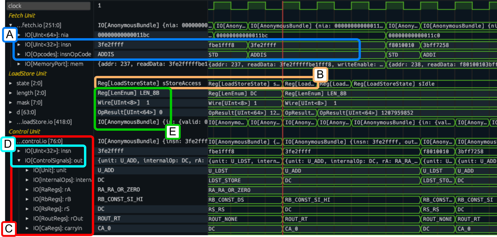
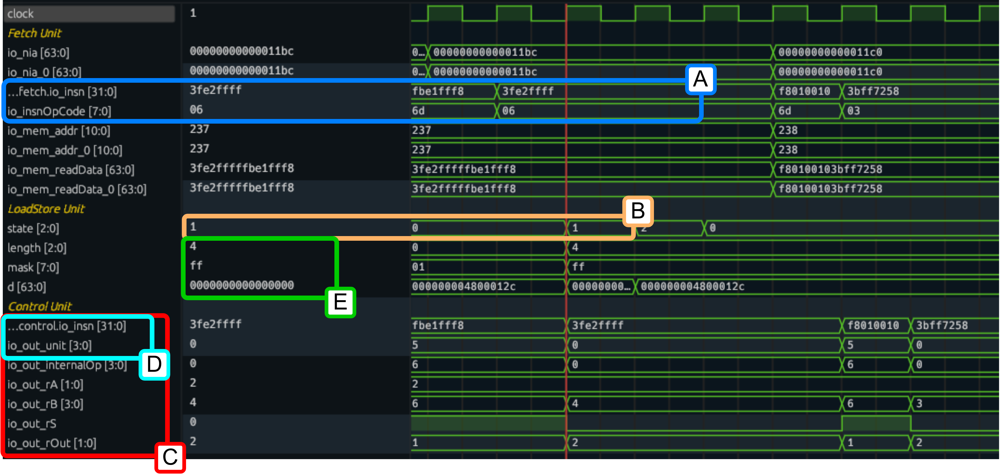

# Tywaves real use case: debugging ChiselWatt

[ChiselWatt](https://github.com/antonblanchard/chiselwatt) is a general-purpose soft-core processor in Chisel that implements a small version of the [OpenPOWER ISA](https://openpowerfoundation.org/specifications/isa/) (Instruction Set Architecture).

This processor has been used in our paper to demonstrate the advantages of Tywaves over standard waveform viewers.

ChiselWatt is published under Chisel 3.5.0 so using the Scala FIRRTL Compiler and ChiselTest. Whereas Tywaves works with newer versions Chisel, using CIRCT and ChiselSim.
Therefore, a [fork](https://github.com/rameloni/chiselwatt/tree/migrate-to-chiselsim) has been made to adapt the implementation to the newer versions. If you would like to try it, please, clone the fork instead of the official repo and simulate it following the [Tywaves usage instructions](./README.md#usage-in-a-project-through-the-tywaves-chisel-api).

> The updates are still a work in progress, so you may find something that differs from the original project or not working yet.
> Once the updates will be complete and the whole functionality ported to the new versions of Chisel a PR will be opened.
>

## Analysis of ChiselWatt

In the main page, the capabilities of Tywaves are already presented with "ad-hoc" examples.
This use case serves to demonstrate that Tywaves also works for an existing implementation
and highlight its applicability to real-world and larger projects.

As known, a general-purpose processor executes a set of instructions of an ISA which might
specify the operations to perform (using *opcodes*) as well as the *operands* used for the
computation.
In ChiselWatt, enumerations can be used to define opcodes, states of computational units,
register identifiers, selectors, etc., allowing manipulation of named values rather than numbers.
This makes the code more readable and maintainable and highlights the importance of 
abstractions in Chisel and consequently of Tywaves, especially for large projects.

The figures below compares the output waveforms from Tywaves with a standard viewre without Tywaves.
The figures present labeled blocks to compare different features and representations:

- Block A: Opcode represented as enums; 
- Block B: State of computational units; 
- Block C: Aggregated signal hierarchies;
- Block D: Types enable clearer distinctions; 
- Block E: Chisel bindings and Chisel-Scala types.

It is clear to see that Tywaves makes easier to inspect which opcode is being fetched or the current state of a 
computational unit (Blocks A and B). Moreover, preserving the hierarchies of the aggregated signals allows keeping the 
same original structure and variable names. When compared to standard, Tywaves representaion allows for a clear 
distinction of aggregates and fields from ground variables and enables collapsing and loading signals of an aggregate as
a whole data structure (Block C). In contrast to classic waveforms, Tywaves keeps the type information, improving the 
understanding of the expected values and what a signal represents, e.g., distinguishing between instructions and control
signals (Block D). Furthermore, Tywaves preserves the distinction between Chisel bindings and Chisel-Scala types, 
enabling the identification between ports, wires, intermediate results, etc., (Block E).

> You can find more details in [`Publications`](./README.md#publications)
 
| Fig. 1 - Tywaves ouptut for ChiselWatt simulation                         |
| ------------------------------------------------------------------------- |
|  |

| Fig. 2 - Standard waveform output for ChiselWatt simulation       |
| ----------------------------------------------------------------- |
|  |

## Reproducing the results
To test ChiselWatt and reproduce the results you can run the `Core.scala` testbench which uses ChiselSim as described in the [README](./README.md#usage-in-a-project-through-the-tywaves-chisel-api) 
of this repository.
Link to the testbench: [chiselwatt/src/test/scala/Core.scala](https://github.com/rameloni/chiselwatt/blob/migrate-to-chiselsim/src/test/scala/Core.scala).

## Additional updates of ChiselWatt
In addition to simple changes from one version to another, such as updating some methods used, more complex updates have 
been required and are described below.

### Replacing `Enum` with `ChiselEnum` in ChiselWatt
In the original version of ChiselWatt, the processor represented Opcodes and states of FSMs using Scala methods 
abstractions or `Enum`. Later versions of Chisel provide [`ChiselEnum`](https://www.chisel-lang.org/docs/explanations/chisel-enum)
as a replacement, so Tywaves provides a representation for them. As a consequence, the opcodes and states have been updated
accordingly.

### Workaround for memory initialization with ChiselSim
Some modules in ChiselWatt had black boxes implementing `initial` Verilog statement for loading of hex memory
files that store a program. With the new versions of Chisel, this would be possible with [`chisel3.util.experimental.loadMemoryFromFileInline`](https://www.chisel-lang.org/docs/appendix/experimental-features#inline-initialization-with-external-file).
However, this feature does not fully work yet with ChiselSim (https://github.com/chipsalliance/chisel/issues/4340). Thus,
as a temporary workaround, I updated ChiselWatt such that the input file is read from Scala code during Chisel elaboration 
and the corresponding memory initialized with a for loop when the system `reset` is high during a simulation with ChiselSim.
