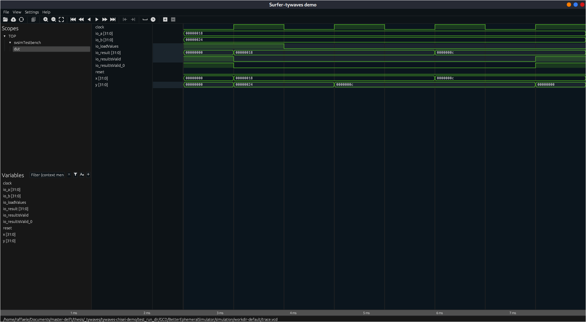
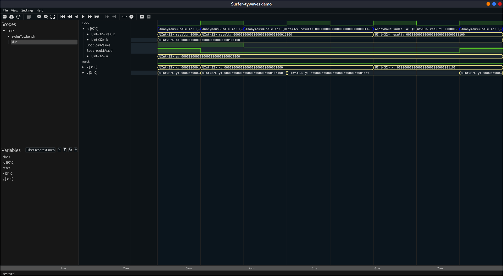
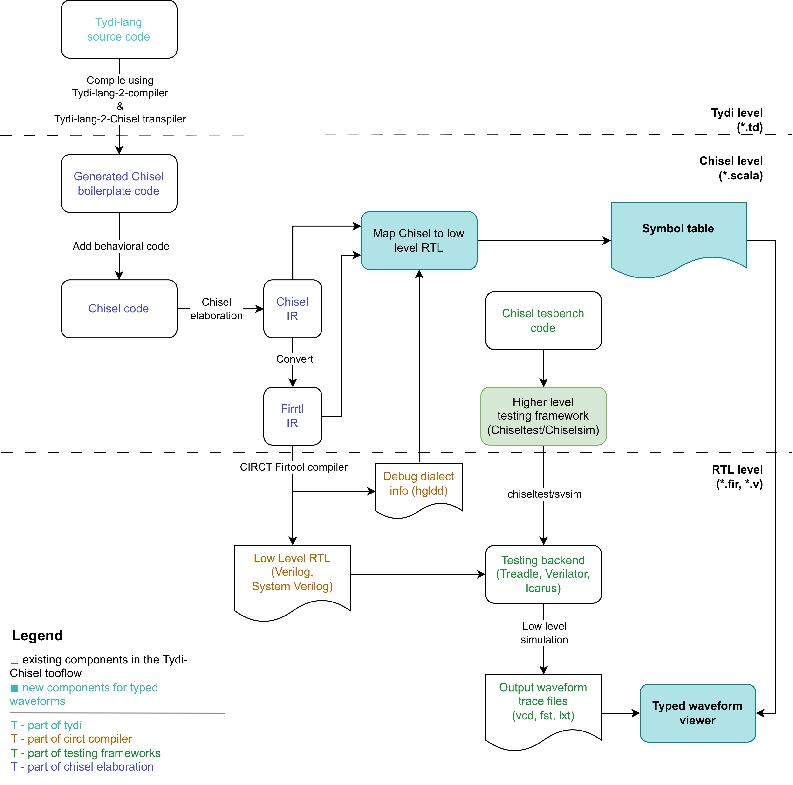

# Tywaves demo project: Chisel backend

Demo backend of the Tywaves project: a type based waveform viewer for Chisel
and [Tydi-Chisel](https://github.com/abs-tudelft/Tydi-Chisel) circuits.
This repo contains functions that parse the information of a Chisel circuit and the debug info emitted by the firtool
compiler, simulate a circuit using ChiselSim and combine all the information to the
[surfer-tywaves-demo](https://gitlab.com/rameloni/surfer-tywaves-demo) frontend (an extension of the Surfer waveform
viewer written in Rust to support Chisel constructs).

Since it is a demo project, it has been tested and developed for a restricted set of examples (it may not work with
all circuits). In the [features](#features) section, you can find the already supported features.

Starting from this demo project, a better implementation and integration in the Chisel/Firrtl infrastructure will be
developed that aims to address the issues
discovered [here](https://github.com/rameloni/Tydi-Chisel-testing-frameworks-analysis).

> Do not use Verilog / System Verilog reserved keywords in Chisel circuit (i.e. `wire`, `reg`).
> In that case, `firtool` will change the `var_name` (which should be `wire`) field of the emitted HGLDD to get a legal
> name as explained in the comments
> [here](https://github.com/llvm/circt/blob/37fbe5e5f5c7a07064d02cea8bf4e8454178fc0e/lib/Target/DebugInfo/EmitHGLDD.cpp#L163C1-L175C2).
> Thus, it is not possible to match Chisel/FIRRTL with the `var_name` in HGLDD.
>
> HGLDD is a file format emitted for other existing tools based on verilog simulations and verilog keywords.
> **I am using it temporarily and in the future firtool will be able to emit a new file format more consistent with
> tywaves.**

# Table of contents

- [Installation](#installation)
    - [Install surfer-tywaves-demo](#install-surfer-tywaves-demo)
    - [Publish locally this scala project](#publish-locally-this-scala-project)
- [Use it on your project](#use-it-on-your-project)
- [Example output](#example-output)
- [Features](#features)
- [How it works internally](#how-it-works-internally)
    - [Drawbacks](#drawbacks)

# Installation

You can run `make all` to install all the pre-requisites.

## Install [surfer-tywaves-demo](https://gitlab.com/rameloni/surfer-tywaves-demo/-/tree/tywaves)

The makefile contains a rule to clone the frontend repository, build and install it.

```bash
make install-surfer-tywaves
make clean # To remove the cloned repository
```

The frontend will be installed as `surfer-tywaves` executable.

## Publish locally this scala project

```bash
make install-chisel-fork
make install-tywaves-backend
```

Once published locally, the `tywaves-demo-backend` can be used by adding the following line to the `build.sbt` file:

```scala
libraryDependencies += "com.github.rameloni" %% "tywaves-backend" % "0.1.0-SNAPSHOT"
```

# Use it on your project

The `TywavesBackend` provides a [simulator](./src/main/tywaves/simulator/BetterEphemeralSimulator.scala) with
functionalities to simulate a circuit through [svsim](https://github.com/chipsalliance/chisel/tree/main/svsim), emit VCD
traces and of course generate the symbol table for the waveform viewer itself automatically.

The following example shows how it is possible also to:

- Enable the trace of the simulation
- Launch the waveform viewer after the simulation
- Set the name of the simulation (it will be used to create a folder with a user defined name for the traces and
  workspace of svsim)
- Use tywaves and expect API to test the circuit

```scala
import tywaves.simulator.TywavesSimulator._
import tywaves.simulator.simulatorSettings._
import org.scalatest.flatspec.AnyFlatSpec

class BarTest extends AnyFlatSpec {
  behavior of "BarTest"
  it should "trace simple bar" in {
    simulate(
      new Bar,
      Seq(VcdTrace, LaunchTywavesWaveforms),
      simName = "trace_simple_bar",
    ) { c =>
      c.io.a.poke(true)
      c.io.b.poke(false)
      c.io.out.expect(false.B)
      c.clock.step()
      c.io.a.poke(true)
      c.io.b.poke(true)
      c.io.out.expect(true.B)
      c.clock.step()
    }
  }
}
```

# Example output

The following images show the classic and tywaves waveform visualization of the [GCD](./src/test/gcd/GCD.scala) module.
It is possible to see that the left picture does not provide any information about Chisel level types and hierarchy.

```scala
class GCD extends Module {
  val io = IO(new Bundle {
    val a             = Input(UInt(32.W))
    val b             = Input(UInt(32.W))
    val loadValues    = Input(Bool())
    val result        = Output(UInt(32.W))
    val resultIsValid = Output(Bool())
  })

  val x = Reg(UInt(32.W))
  val y = Reg(UInt(32.W))

  when(x > y)(x := x -% y).otherwise(y := y -% x)
  when(io.loadValues) {
    x := io.a
    y := io.b
  }
  io.result := x
  io.resultIsValid := y === 0.U
}
```

| Only VCD loaded                                    | Tywaves (VCD + symbol table)                                |
|----------------------------------------------------|-------------------------------------------------------------|
|  |  |

# Features

- [x] Parse and map Chisel/FIRRTL/Verilog circuits
- [x] Emit VCD traces from the simulator (both with and without underscores in the signal names)
- [x] 
- [x] Automatically generate the symbol table for the waveform viewer
    - [x] Dump Chisel types in the final symbol table
    - [x] Represent hierarchical structures of bundles
    - [ ] Represent vectors
    - [ ] Represent enums
    - [ ] Represent hierarchical modules
    - [ ] For loops code generation
    - [ ] Reg with init

# How it works internally

The following diagram shows the main components of the demo project and how they interact with each other.


It retrieves, parses and finally maps together the Intermediate Representation (IR) of the Chisel, Firrtl and debug info
emitted by the firtool (HGLDD) to output a symbol table that can be used by the frontend to display the waveform.
It aims to map each high level signal (Chisel) to the low level signal (System Verilog) and vice versa. Usually, HGLDD
would be enough, but it does provide only information about FIRRTL-to-SystemVerilog mapping, so it does not contain user
types information.

In this small example if I use only HGLDD I would be able to see that they are both bundles, but it is not possible to
see that they are actually `MyFloat` and `IntCoordination` respectively. Also `Bool`, `UInt`, `SInt` would not be
retrieved from HGLDD/FIRRTL only. From here the reason to use Chisel IR to get the user types information.

```scala
class MyFloat extends Bundle {
  val sign        = Bool()
  val exponent    = UInt(8.W)
  val significand = UInt(23.W)
}

class IntCoordination extends Bundle {
  val x = SInt(32.W)
  val y = SInt(32.W)
}
```

## Drawbacks

Chisel IR is an **internal** IR, and it is not meant to be used by external tools. It is not stable, and it can change
basing on additional future features. It will be really hard to maintain this project for future Chisel versions.
Therefore, I planned to "integrate" a functionality to directly transfer Chisel information to FIRRTL. In this way,
the `firtool` would be able to access all the needed information for `surfer-tywaves-demo` to render the signals.
This would also allow to simplify the process that `tywaves-demo-backend` currently does to generate the symbol table,
improving performances. And it may extend the support to other languages/dialects in
the [CIRCT](https://circt.llvm.org/) ecosystem.