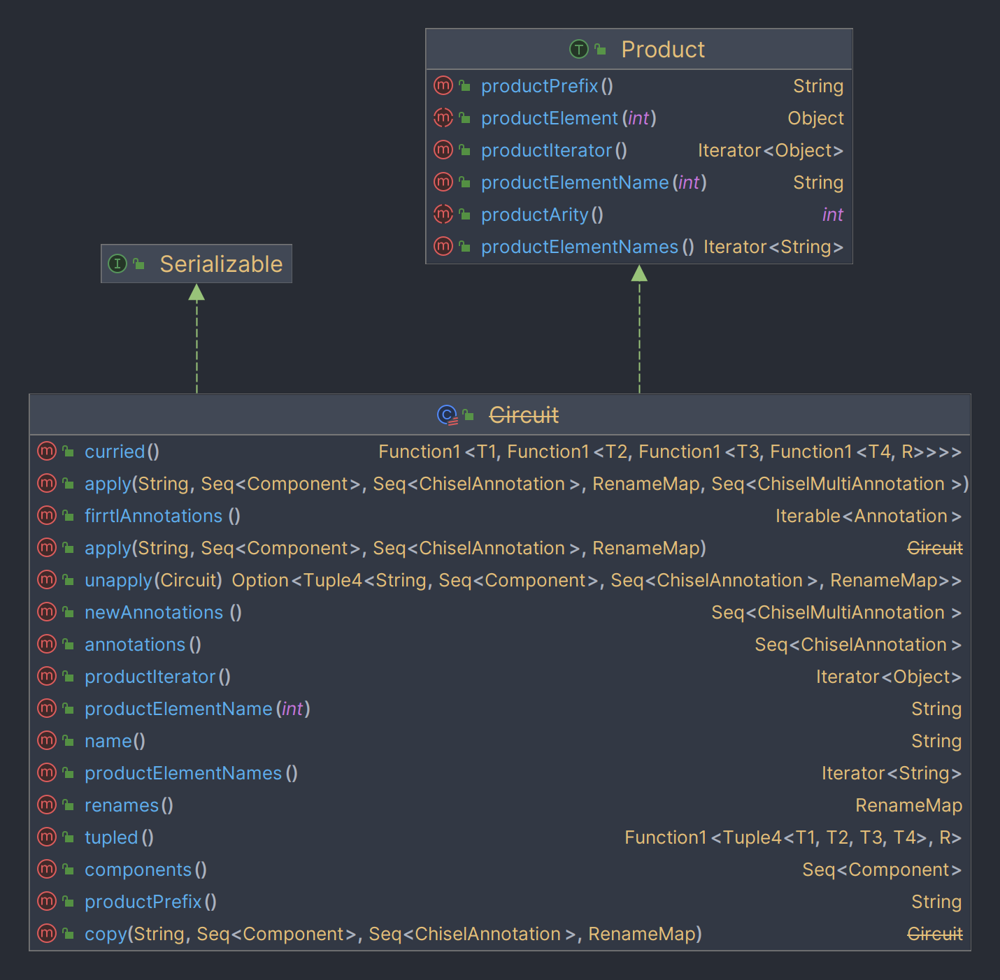
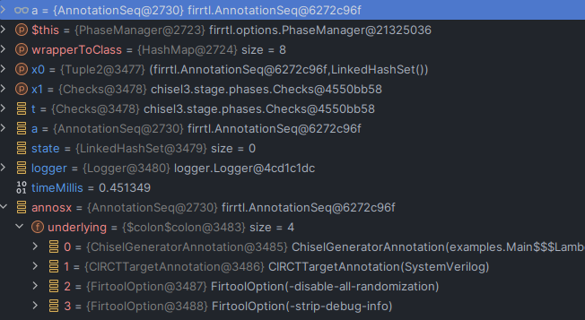
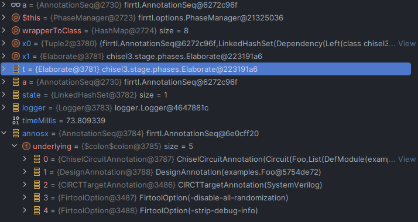
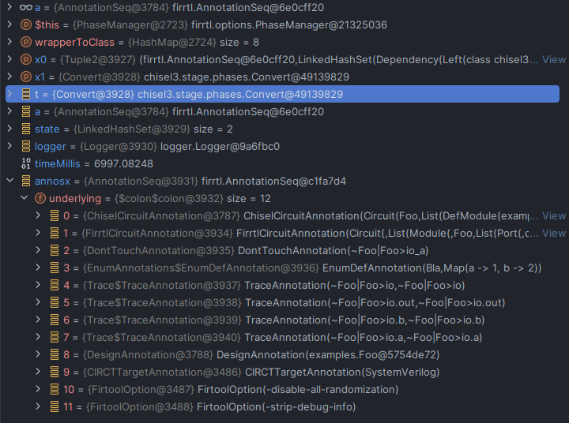
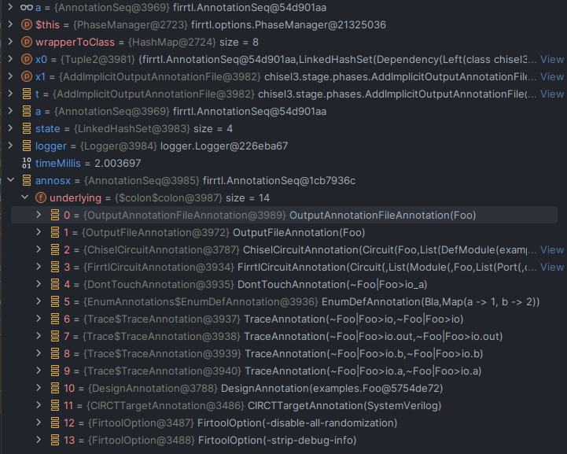
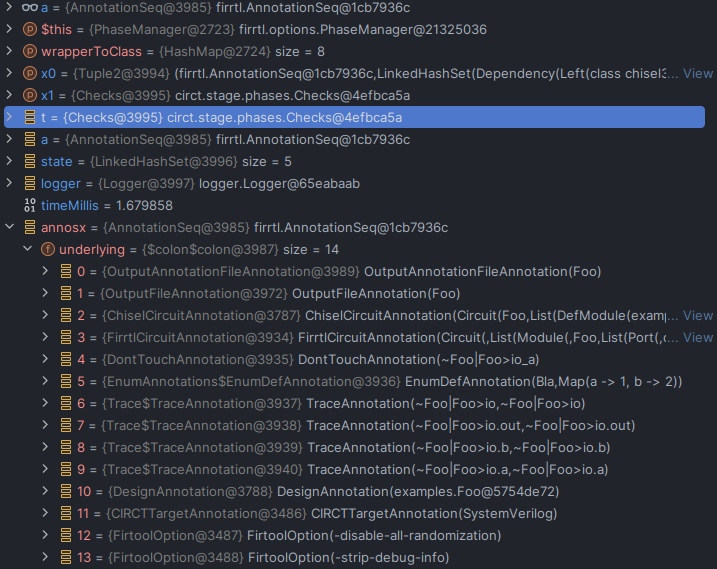
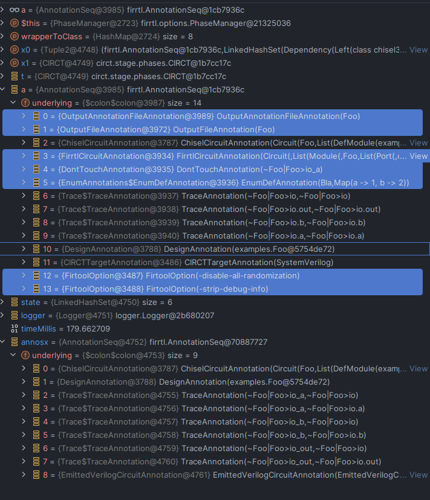

# Treadle extension

## TODO for feasibility test

- [x] Set up the project
- [x] Create a really simple Chisel example
- [ ] Import what I already wrote during the experiments in December 2023

# ChiselSim: call stack

## Starting the simulation

## Step 1: Create the simulator

This is the simulator trait that provides function to run the simulation (its methods simulate and processBackends
should not be changed).

```scala
trait SingleBackendSimulator[T <: Backend] extends Simulator {
  val backend: T

  def tag: String

  def commonCompilationSettings: CommonCompilationSettings

  def backendSpecificCompilationSettings: backend.CompilationSettings

  final def processBackends(processor: Simulator.BackendProcessor): Unit = {
    processor.process(backend)(tag, commonCompilationSettings, backendSpecificCompilationSettings)
  }

  def simulate[T <: RawModule, U](
                                   module: => T
                                 )(body: (Simulation.Controller, T) => U
                                 ): Simulator.BackendInvocationDigest[U] = {
    _simulate(module)(body).head
  }
}
```

## Step 2: Run the simulation (the module is not elaborated yet)

When the `simulate` method is called, it calls the `_simulate` method which is defined as follows:

```scala
 private[simulator] def _simulate[T <: RawModule, U](
                                                      module: => T
                                                    )(body: (Simulation.Controller, T) => U
                                                    ): Seq[Simulator.BackendInvocationDigest[U]] = {
  // Imp: the workspace is created
  val workspace = new Workspace(path = workspacePath, workingDirectoryPrefix = workingDirectoryPrefix)
  workspace.reset()
  // Imp: the module is elaborated
  val (dut, ports) = workspace.elaborateGeneratedModuleInternal({ () => module })
  workspace.generateAdditionalSources()
  val compiler = new Simulator.WorkspaceCompiler(
    workspace,
    customSimulationWorkingDirectory,
    verbose,
    { controller =>
      require(Simulator.dynamicSimulationContext.value.isEmpty, "Nested simulations are not supported.")
      val context = Simulator.SimulationContext(ports, controller)
      Simulator.dynamicSimulationContext.withValue(Some(context)) {
        val outcome = body(controller, dut)
        context.completeSimulation()
        outcome
      }
    }
  )
  processBackends(compiler)
  compiler.results.toSeq
}
```

### Step 3.1: Elaborate the module and execute the chisel stage

`ChiselStage.execute`

```scala
private[simulator] def elaborateGeneratedModuleInternal[T <: RawModule](
                                                                         generateModule: () => T
                                                                       ): (T, Seq[(Data, ModuleInfo.Port)]) = {
  // Use CIRCT to generate SystemVerilog sources, and potentially additional artifacts
  var someDut: Option[T] = None
  // Imp: Executing the chisel stage
  val outputAnnotations  = (new circt.stage.ChiselStage).execute(
    Array("--target", "systemverilog", "--split-verilog"),
    Seq(
      chisel3.stage.ChiselGeneratorAnnotation { () =>
        val dut = generateModule()
        someDut = Some(dut)
        dut
      },
      circt.stage.FirtoolOption("-disable-annotation-unknown"),
      firrtl.options.TargetDirAnnotation(workspace.supportArtifactsPath)
    )
  )
  // Other operations ...
}
```

```scala
// Imp: ChiselStage execute
final def execute(args: Array[String], annotations: AnnotationSeq): AnnotationSeq =
  transform(shell.parse(args, annotations)) // Imp: here the [[args]] and the [[annotations]] are merged together for the next step
```

Stage is executed with some input annotations.

```scala
final def transform(annotations: AnnotationSeq): AnnotationSeq = {
  val annotationsx =
    Seq(new phases.GetIncludes)
      .foldLeft(annotations)((a, p) => p.transform(a))

  Logger.makeScope(annotationsx) {
    Seq(
      new phases.AddDefaults,
      new phases.Checks,
      new Phase {
        def transform(a: AnnotationSeq) = run(a) // THIS run is the method of the specific stage -> in my case ChiselStage
      }, // imp: here the chisel stage phases are executed
      new phases.WriteOutputAnnotations
    )
      .foldLeft(annotationsx)((a, p) => p.transform(a))
  }
}
```

The annotations executed are:

- `chisel3.stage.ChiselGeneratorAnnotation`
- `circt.stage.FirtoolOption("-disable-annotation-unknown")`
- `firrtl.options.TargetDirAnnotation(workspace.supportArtifactsPath)`

### Step 3.2: ChiselStage run phases

Thanks to these phases (and the one before (`AddDefaults`, `Checks`, `WriteOutputAnnotation`)) the circuit is elaborated
and transformed into the final one.

```scala
  override def run(annotations: AnnotationSeq): AnnotationSeq = {
  val pm = new PhaseManager(
    targets = Seq(
      Dependency[chisel3.stage.phases.Checks],
      Dependency[chisel3.stage.phases.AddImplicitOutputFile],
      Dependency[chisel3.stage.phases.AddImplicitOutputAnnotationFile],
      Dependency[chisel3.stage.phases.MaybeAspectPhase],
      Dependency[chisel3.stage.phases.AddSerializationAnnotations],
      Dependency[chisel3.stage.phases.Convert],
      Dependency[chisel3.stage.phases.MaybeInjectingPhase],
      Dependency[circt.stage.phases.AddImplicitOutputFile],
      Dependency[circt.stage.phases.Checks],
      Dependency[circt.stage.phases.CIRCT]
    ),
    currentState = Seq(
      Dependency[firrtl.stage.phases.AddDefaults],
      Dependency[firrtl.stage.phases.Checks]
    )
  )
  pm.transform(annotations)
}
```

# Mapping

## Getting the annotations

By using what I did in `ChiselMapper` I can get:

- `elaborationAnnos`
- `aspectAnnos`
- `converterAnnos` got `chisel3.stage.phases.Convert.transform(aspectAnnos)` which prepares the circuit for FIRRTL
  compilation. It specifically contains:
    - A `ChiselCircuitAnnotation` used to store a chisel circuit (`chisel3.stage.ChiselCircuitAnnotation`)
    - A `FirrtlCircuitAnnotation` used to store a firrtl circuit (`chisel3.internal.firrtl.Circuit`)
    - A `DesignAnnotation` used to store a design (a chisel module)

Therefore, it seems that `ChiselCircuitAnnotation` and `FirrtlCircuitAnnotation` can be used to retrieve a mapping from
Chisel level source code to FIRRTL.

## Analysing the annotations

By looking at the documentation, running the debugger and setting a breakpoint in the `ChiselMapper` I can see what the
annotations actually contains.

### `ChiselCircuitAnnotation`

```scala
case class ChiselCircuitAnnotation(circuit: chisel3.internal.firrtl.Circuit)
  extends NoTargetAnnotation with ChiselOption with Unserializable {
  // ...
}
```

The circuit is characterized by:

| Field          | Description                        |
|----------------|------------------------------------|
| name           | The name of the circuit            |
| components     | The components of the circuit      |
| annotations    | The annotations of the circuit     |
| renames        | The renames of the circuit         |
| newAnnotations | The new annotations of the circuit |

```scala
case class Circuit(name:    String, components: Seq[Component], annotations: Seq[ChiselAnnotation],
                   renames: RenameMap, newAnnotations: Seq[ChiselMultiAnnotation])
```



#### Chisel Circuit `Component`

There are 3 types of components:

- `DefModule`:
  ```scala
  case class DefModule(id: RawModule, name: String, ports: Seq[Port], commands: Seq[Command]) extends Component
  ```
  Which contains the `RawModule`, a `name`, a sequence of `Port` and a sequence of `Command`.
    - `Port`: an input output port. For the direction of ports inside a Bundle, checks the actual direction. A `Data` id
      can be parsed using a case match.
  ```scala
  case class Port(id: Data, dir: SpecifiedDirection, sourceInfo: SourceInfo)
  ```
    - `Command`: there are different commands that can be used in the ChiselIR. With the commands I could rebuild the
      circuit. The temporary signals generated by commands are dropped (see the lecture about chisel internals to know
      how an assignment is elaborated: `io.out := io.a & io.b`). They are called (_underscored signals_) and their
      optimization can be prevented by using `VcdShowUnderScoredAnnotation`.
  ```scala
  case class DefPrim[T <: Data](sourceInfo: SourceInfo, id: T, op: PrimOp, args: Arg*) extends Definition
  case class DefInvalid(sourceInfo: SourceInfo, arg: Arg) extends Command
  case class DefWire(sourceInfo: SourceInfo, id: Data) extends Definition // Tells that id is a wire
  case class DefReg(sourceInfo: SourceInfo, id: Data, clock: Arg) extends Definition
  case class DefMemory(sourceInfo: SourceInfo, id: HasId, t: Data, size: BigInt) extends Definition
  // ... more definitions inside chisel3/internal/firrtl/IR.scala
  ```
- `DefBlackBox`:
  ```scala
  case class DefBlackBox(id: BaseBlackBox, name: String, ports: Seq[Port], topDir: SpecifiedDirection, params: Map[String, Param]) extends Component
  ```
- `DefIntrinsicModule`:
  ```scala
  private[chisel3] case class DefIntrinsicModule(id: BaseIntrinsicModule, name: String, ports: Seq[Port], topDir: SpecifiedDirection, params: Map[String, Param]) extends Component
  ```

> So far I have met only the `DefModule` type. No `DefBlackBox` nor `DefIntrinsicModule` have been found.

#### Chisel Circuit `RenameMap`

Map old names to new names. I have not met yet a usage example for this. So I don't really know when it is used.

#### Chisel Circuit `ChiselAnnotation`

```scala
/** Interface for Annotations in Chisel
 * Defines a conversion to a corresponding FIRRTL Annotation
 */
trait ChiselAnnotation {
  /** Conversion to FIRRTL Annotation */
  def toFirrtl: Annotation
}
```

For example the `dontTouch` annotation is implemented as follows:

```scala
object dontTouch {
  def apply[T <: Data](data: T): T = {
    requireIsHardware(data, "Data marked dontTouch")
    // Add the annotation to the builder annotations
    annotate(new ChiselAnnotation {
      def toFirrtl = DontTouchAnnotation(data.toNamed) // this basically creates an annotation for firrtl
    })
    data
  }
}

// ...
case class DontTouchAnnotation(target: ReferenceTarget) extends SingleTargetAnnotation[ReferenceTarget] {
  def targets = Seq(target)

  def duplicate(n: ReferenceTarget) = this.copy(n)

  // def update is already implemented
}
```

### `FirrtlCircuitAnnotation`

```scala
case class FirrtlCircuitAnnotation(circuit: Circuit) extends NoTargetAnnotation with FirrtlOption {
  // ...
} 
```

The circuit is characterized by:

| Field   | Description                |
|---------|----------------------------|
| info    | The info of the circuit    |
| modules | The modules of the circuit |
| main    | The main module name       |

```scala
case class Circuit(info: Info, modules: Seq[DefModule], main: String) extends FirrtlNode with HasInfo with UseSerializer
```

#### Firrtl Circuit `DefModule`

It is a base class for modules in the FIRRTL IR.

```scala
abstract class DefModule extends FirrtlNode with IsDeclaration {
  val info : Info
  val name : String
  val ports: Seq[Port]
}

case class Port(info: Info, name: String, direction: Direction, tpe: Type)
```

DefModule is extended by several classes, for example:

- An internal Module which is an instantiable hardware block containing a list of ports and internal statements.

```scala
case class Module(info: Info, name: String, ports: Seq[Port], body: Statement) extends DefModule with UseSerializer
```

- Also `ExtModule` and `IntModule` but I have not met them yet.

#### `Statement`

It is similar to the `Command` in the Chisel IR. It is a base class for all statements in the FIRRTL IR.

```scala
case class DefWire(info: Info, name: String, tpe: Type) extends Statement with IsDeclaration with UseSerializer
```

```scala
case class DefInstance(info: Info, name: String, module: String, tpe: Type = UnknownType)
  extends Statement
    with IsDeclaration
    with UseSerializer
```

And so on.

## The object `Converter`

It should provide functions for converting Chisel to FIRRTL and vice versa. It allows to convert a Chisel circuit to a
FIRRTL. It is used during the Compiler call. It is used in the ChiselStage phase.

The call stack in brief:

- When an elaboration function of `object ChiselStage` like `emitSystemVerilog` is called, it calls the `transform`
  method of a `PhaseManager` (an object that ensures that phases are executed). The transform specifically applies
  transformations on the input annotations. The following is the phase manager used inside the `ChiselStage`.
  ```scala
  private def phase = new PhaseManager(
    Seq(
      Dependency[chisel3.stage.phases.Checks],          // Sanity checks before running the main Phases
      Dependency[chisel3.aop.injecting.InjectingPhase], // Consumes the DesignAnnotation and converts every Aspect (specify what behaviour should be done to instance) into annotations
      Dependency[chisel3.stage.phases.Elaborate],       // Elaborate chiselGeneratorAnnotation to ChiselCircuitAnnotation
      Dependency[chisel3.stage.phases.Convert],         // Convert ChiselCircuitAnnotation to FirrtlCircuitAnnotation
      Dependency[circt.stage.phases.AddImplicitOutputFile], // 
      Dependency[chisel3.stage.phases.AddImplicitOutputAnnotationFile],
      Dependency[circt.stage.phases.Checks],
      Dependency[circt.stage.phases.CIRCT] // Run the CIRCT compiler
      )
  )
  ```
- The Convert phase uses internally the `Converter` object to performs transformations for the Chisel to FIRRTL
  conversion. I can potentially use that to get the mapping from Chisel to FIRRTL.
- However, the Converter is `private[chisel3]` so I cannot use it directly. I have to use the `transform` method of the
  `Convert` phase. But it just provides me a transformation without reference to the original circuit.

| Phase                           | Image                   | Comments                                                    |
|---------------------------------|-------------------------|-------------------------------------------------------------|
| Checks                          |      |                                                             |
| InjectingPhase                  |                         |                                                             |
| Elaborate                       |  | `ChiselCircuitAnnotation` is available now                  |
| Convert                         |  | `FirrtlCircuitAnnotation` is now available                  |
| AddImplicitOutputFile           |  |                                                             |
| AddImplicitOutputAnnotationFile |  |                                                             |
| Checks                          |  |                                                             |
| CIRCT                           |  | Some annotations are consumed, therefore, not returned back |

 