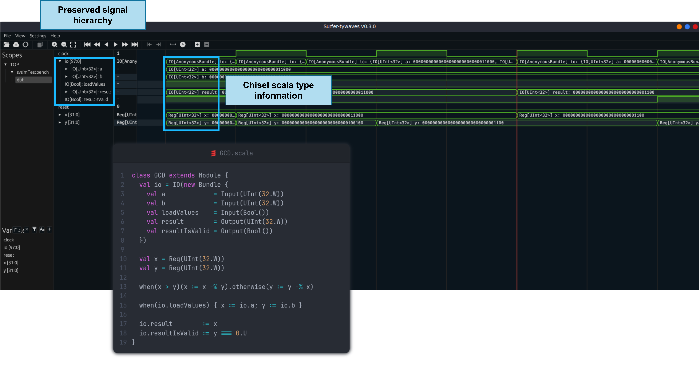
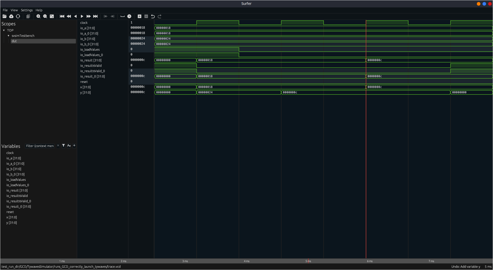

# Tywaves project: a type based waveform viewer for Chisel and Tydi-Chisel

This repository contains a summary of the Tywaves project and an API to easily use it for testing a Chisel project.
Tywaves consists of implementing a new type based waveform viewer for [Chisel](https://www.chisel-lang.org/)
and [Tydi-Chisel](https://github.com/abs-tudelft/Tydi-Chisel) circuits.

The full project aims to successfully display waveforms of a Chisel circuit while **maintaining the source code
structure, constructs, hierarchies and source language type information (the scala data type and constructor parameters)
of signals and modules**.

To achieve this goal, the project should:

1. collect high-level debug information (DI) of a circuit;
2. elaborate the DI in order to associate it with the values in a trace from a simulator, in other words an association
   with the signals and modules output of a chisel-CIRCT compilation;
3. emit a well-defined file format that a viewer can read together with a trace file to properly display the waveforms;
4. make everything compatible and portable with the
   new [ChiselSim](https://www.chisel-lang.org/docs/appendix/migrating-from-chiseltest).



```
If you are interested in using the tool and have any feedback on its implementation, 
please open an issue or contact me.
```

## Internal functionality

**The internal structure of the Tywaves project, how it works and details about the work done can be
found in the [**wiki**](https://github.com/rameloni/tywaves-chisel-demo/wiki) pages.**

> **Note**: The Tywaves project is currently under development. For now, the new functionality in `chisel`, `firtool`
> and `surfer` is available in my forks of the repositories. Pull-requests will be made to the official repositories
> soon. This will allow the Tywaves project to have a better integration and availability directly in the official
> releases.

# Table of contents

- [Tywaves project: a type based waveform viewer for Chisel and Tydi-Chisel](#tywaves-project-a-type-based-waveform-viewer-for-chisel-and-tydi-chisel)
  - [Internal functionality](#internal-functionality)
- [Table of contents](#table-of-contents)
- [Getting started](#getting-started)
  - [Prerequisites](#prerequisites)
  - [Installation](#installation)
    - [Install surfer-tywaves](#install-surfer-tywaves)
    - [Download and install the forks of Chisel and Firtool](#download-and-install-the-forks-of-chisel-and-firtool)
    - [Install and publish locally this library: Tywaves-Chisel-API](#install-and-publish-locally-this-library-tywaves-chisel-api)
- [Usage in a project through the Tywaves-Chisel-API](#usage-in-a-project-through-the-tywaves-chisel-api)
  - [List of available settings of the simulators](#list-of-available-settings-of-the-simulators)
  - [Run a quick simple example](#run-a-quick-simple-example)
- [Features](#features)
  - [Future work](#future-work)
- [Versioning and tools (ref)](#versioning-and-tools-ref)
  - [Old backend implementations (ref)](#old-backend-implementations-ref)
- [Publications](#publications)
- [License](#license)

# Getting started

## Prerequisites

The full project depends on the following tools. To install them, please check the links below:

- [Make](https://www.gnu.org/software/make/)
- [Scala and sbt](https://docs.scala-lang.org/getting-started/sbt-track/getting-started-with-scala-and-sbt-on-the-command-line.html)
  and [scala-cli](https://scala-cli.virtuslab.org/install) (_Note: Java versions prior to Java 11, tywaves may not work
  correctly_)
- [Rust](https://www.rust-lang.org/tools/install)
- `openssl` for installing the waveform
  gui ([instructions](https://gitlab.com/rameloni/surfer-tywaves-demo#compiling-from-source))
- [Verilator](https://www.veripool.org/projects/verilator/wiki/Installing) (recommended `v4.228+`)

## Installation

The [Makefile](./Makefile) contains all the necessary commands to install the tools and the Tywaves-Chisel-API library.

You can run `make all` to install everything in one go, or you can install the components separately.

### Install surfer-tywaves

To install the latest [release](https://gitlab.com/rameloni/surfer-tywaves-demo/-/releases) of the fork:

```bash
make install-surfer-tywaves
make clean # Delete the cloned repository
```

or install the development version:

```bash
make install-surfer-tywaves-dev
make clean
```

### Download and install the forks of Chisel and Firtool

```bash
make install-chisel-fork
make install-firtool-fork-bin # Download the Linux precompiled version (too long to compile)
```

If you want to compile the `firtool` from source, you can check
the [instructions](https://github.com/rameloni/circt?tab=readme-ov-file#setting-this-up), once cloned the
correct [version](#versioning-and-tools).

### Install and publish locally this library: Tywaves-Chisel-API

```bash
git checkout <your-release>
make install-tywaves-chisel-api
```

Once published locally, you can use it in your project by adding the following line to your `build.sbt` file:

```scala
libraryDependencies += "com.github.rameloni" %% "tywaves-chisel-api" % "your-version-here"
```

# Usage in a project through the Tywaves-Chisel-API

The `Tywaves-Chisel-API` is a library that allows to easily enable the Tywaves in a Chisel project. It provides 2
high-level simulators with functionalities to simulate a circuit
through [svsim](https://github.com/chipsalliance/chisel/tree/main/svsim), emit VCD traces and generate a symbol table
for the surfer-tywaves waveform viewer itself automatically:

- [ParametricSimulator](./src/main/scala/tywaves/simulator/ParametricSimulator.scala): provides some generic
  features such as VCD trace emission, name the trace file, pass additional arguments to firtool before simulation, save
  the workspace of svsim.[^1]
- [TywavesSimulator](./src/main/scala/tywaves/simulator/TywavesSimulator.scala): it extends the parametric simulator in
  order to generate extra debug information and optionally launch the waveform viewer directly after the simulation.

Their usage is very similar to [ChiselTest](https://github.com/ucb-bar/chiseltest)
and [EphemeralSimulator](https://www.chisel-lang.org/docs/appendix/migrating-from-chiseltest#migration) since they both
implement the `PeekPokeAPI`, but they use the new official ChiselSim, and they offer additional features compared to
EphemeralSimulator. A simulation can be run as follows:

```scala
// Import the simulator

import tywaves.simulator.simulatorSettings._
import tywaves.simulator.ParametricSimulator._
//import tywaves.simulator.TywavesSimulator._

simulate(
  new DUT(), // The module to simulate
  settings = Seq(/* List of simulator settings */),
  simName = "Name_of_the_simulation", // used to name the directory in test_run_dir
) {
  dut => // Body of the simulation using the PeekPokeAPI
}
```

## List of available settings of the simulators

A simulation can be customized by passing some settings to the simulator. The following options can be specified
for `ParametricSimulator` and / or `TywavesSimulator` classes using the following syntax:

| Setting                                     | Description                                                                                                                                                                                         | Simulator                                    |
| :------------------------------------------ | --------------------------------------------------------------------------------------------------------------------------------------------------------------------------------------------------- | -------------------------------------------- |
| `VcdTrace`                                  | Enable the VCD output optimizing out signals starting with an underscore (_) in the final verilog                                                                                                   | `ParametricSimulator` and `TywavesSimulator` |
| `VcdTraceWithUnderscore`                    | Enable the VCD output (including "underscored" signals)                                                                                                                                             | `ParametricSimulator` and `TywavesSimulator` |
| `SaveWorkdir`                               | Save the workdir of `svsim`                                                                                                                                                                         | `ParametricSimulator` and `TywavesSimulator` |
| `SaveWorkdirFile(name: String)`             | Save the workdir with a specific name                                                                                                                                                               | `ParametricSimulator` and `TywavesSimulator` |
| `NameTrace(name: String)`                   | Give a name to the VCD trace                                                                                                                                                                        | `ParametricSimulator` and `TywavesSimulator` |
| `WithFirtoolArgs(args: Seq[String])`        | Pass arguments to `firtool` under the simulation                                                                                                                                                    | `TywavesSimulator`                           |
| `WithTywavesWaveforms(runWaves: Boolean)`   | Enable the generation of extra debug information (to fully exploit the tywaves project) and (optionally `runWaves=true`) launch the waveform viewer directly once the simulation has been completed | `ParametricSimulator` and `TywavesSimulator` |
| `WithTywavesWaveformsGo(runWaves: Boolean)` | Same as `WithTywavesWaveforms` but without blocking sbt if `runWaves` is `true`                                                                                                                     | `TywavesSimulator`                           |

> **Note**: please open an issue/PR to request new settings.

## Run a quick simple example

To run a quick example you can try to run the examples in the [examples](./example) folder.

```bash
cd example
# Run the gcd example
scala-cli test gcd.test.scala

# Run a Tydi-Chisel example
scala-cli test tydi-chisel.test.scala
```

The following images show the classic and tywaves waveform visualization of the [GCD](./example/gcd.test.scala)
module.

```scala
/** A simple module useful for testing Chisel generation and testing */
class GCD extends Module {
  val io = IO(new Bundle {
    val a             = Input(UInt(32.W))
    val b             = Input(UInt(32.W))
    val loadValues    = Input(Bool())
    val result        = Output(UInt(32.W))
    val resultIsValid = Output(Bool())
  })

  val x = Reg(UInt(32.W))
  val y = Reg(UInt(32.W))

  when(x > y)(x := x -% y).otherwise(y := y -% x)

  when(io.loadValues) {
    x := io.a
    y := io.b
  }

  io.result := x
  io.resultIsValid := y === 0.U
}
```

| Only VCD loaded                                     | Tywaves                                                     |
| --------------------------------------------------- | ----------------------------------------------------------- |
|  |  |

# Features

The following list shows a summary of the features added by the Tywaves project to Chisel/CIRCT and Surfer:

- [x] Parse and map Chisel/FIRRTL/Verilog circuits
- [x] Emit VCD traces from the simulator (both with and without underscores in the signal names)
- [x] Automatic debug information generation (from Chisel through CIRCT to the waveform viewer)
    - [x] Dump Chisel types
    - [x] Dump constructor parameters in the final symbol table
    - [x] Distinguish IO, Reg and wires
- [x] Chisel data types representation (basic):
    - [x] Hierarchical structures of bundles
    - [x] Vectors
    - [x] Enums
    - [x] Hierarchical modules (modules with children)
        - [x] Generic submodules (all different types of modules)
        - [x] Variants of the same module (i.e. parametric module)
        - [x] Instances of the same module
- [ ] Chisel data types representation (advanced):
    - [ ] Type visualization for module instances (scopes in the waveform viewer)
    - [ ] Constructor parameters for both signals and modules
    - [x] Selectable signal value rendering (with type information attached)
    - [ ] Automatic/custom signal value rendering
    - [ ] For loops code generation
    - [x] Temporary values (also inside `when` and `otherwise` blocks)

## Future work
- Internals
  - Use [intrinsics](https://circt.llvm.org/docs/Dialects/FIRRTL/FIRRTLIntrinsics/) as a communication method to propagate type information between Chisel and CIRCT instead of [FIRRTL annotations](https://circt.llvm.org/docs/Dialects/FIRRTL/FIRRTLAnnotations/). Annotations are used temporarily and need to be replaced with a mechanism more suitable for MLIR operations. This change should enable the acceptance of PRs in the official repositories.
  - Create a new debug file format independent of HGLDD that is free from the code patterns and limitations of VCS internals. HGLDD is built using some internal VCS names and methods that overcomplicate the format in general cases.
- Performance
  - Profiling and performance overhead
  - Remove the VCD rewriter step to improve the performance of `tywaves-rs` and Surfer.
  - Parallelize the [`TyVcdBuilder`](https://github.com/rameloni/tywaves-rs/blob/6880f6b20b661e88baae7555cb2e8b33763a8148/src/tyvcd/builder.rs#L30-L38) to further improve the performance of the viewer.
- Feature Extensions
  - Extend and test the infrastructure of Tywaves to support other languages integrated into CIRCT.
  - Enable type information for module instances in the viewer UI.
  - Automatically choose how to render a value based on the type name: either based on the name of the type or by defining an API that allows users to define how to render a value, similar to a `toString()` method.
  - Enable switching between multiple IRs in the viewer dynamically (i.e., Chisel, FIRRTL, Verilog).
  - Introduce a new specific visualization for hardware streaming interfaces (i.e., providing a new abstract view like showing deserializing a whole message received). This would work for Tydi but also for other streaming protocols if a standard interface for visualization is provided.

# Versioning and tools ([ref](https://github.com/rameloni/tywaves-chisel-demo/wiki/Tywaves-internals#tywaves-software-architecture))

Use the new name of the library in your sbt dependencies: `com.github.rameloni::tywaves-chisel-api:<version>`.

> **IMPORTANT NOTE**: Always use the latest version of Tywaves

| Release                                                                                        | Chisel fork version (from `rameloni/chisel`)                                                       | Firtool fork version (from `rameloni/circt`)                                     | Tywaves-rs version                                                            | Surfer-tywaves version                                                                                                |
| :--------------------------------------------------------------------------------------------- | :------------------------------------------------------------------------------------------------- | :------------------------------------------------------------------------------- | :---------------------------------------------------------------------------- | :-------------------------------------------------------------------------------------------------------------------- |
| [0.4.1-SNAPSHOT](https://github.com/rameloni/tywaves-chisel-demo/releases/tag/v0.4.1-SNAPSHOT) | [v6.4.3-tywaves-SNAPSHOT](https://github.com/rameloni/chisel/releases/tag/v6.4.3-tywaves-SNAPSHOT) | [v0.1.4](https://github.com/rameloni/circt/releases/tag/v0.1.4-tywaves-SNAPSHOT) | [v0.1.4](https://github.com/rameloni/tywaves-rs/releases/tag/v0.1.4-SNAPSHOT) | [v0.3.2-tywaves-dev-SNAPSHOT](https://gitlab.com/rameloni/surfer-tywaves-demo/-/releases/v0.3.2-tywaves-SNAPSHOT)     |
| [0.4.0-SNAPSHOT](https://github.com/rameloni/tywaves-chisel-demo/releases/tag/v0.4.0-SNAPSHOT) | [v6.4.3-tywaves-SNAPSHOT](https://github.com/rameloni/chisel/releases/tag/v6.4.3-tywaves-SNAPSHOT) | [v0.1.3](https://github.com/rameloni/circt/releases/tag/v0.1.3-tywaves-SNAPSHOT) | [v0.1.4](https://github.com/rameloni/tywaves-rs/releases/tag/v0.1.4-SNAPSHOT) | [v0.3.2-tywaves-dev-SNAPSHOT](https://gitlab.com/rameloni/surfer-tywaves-demo/-/releases/v0.3.2-tywaves-SNAPSHOT)     |
| [0.3.0-SNAPSHOT](https://github.com/rameloni/tywaves-chisel-demo/releases/tag/v0.3.0-SNAPSHOT) | [v6.4.2-tywaves-SNAPSHOT](https://github.com/rameloni/chisel/releases/tag/v6.4.2-tywaves-SNAPSHOT) | [v0.1.1](https://github.com/rameloni/circt/releases/tag/v0.1.1-tywaves-SNAPSHOT) | [v0.1.1](https://github.com/rameloni/tywaves-rs/releases/tag/v0.1.1-SNAPSHOT) | [v0.3.0-tywaves-dev-SNAPSHOT](https://gitlab.com/rameloni/surfer-tywaves-demo/-/releases/v0.3.0-tywaves-dev-SNAPSHOT) |

## Old backend implementations ([ref](https://github.com/rameloni/tywaves-chisel-demo/wiki/An-alternative-solution-(old-demo-version)))

Use the old name of the library in your sbt dependencies: `com.github.rameloni::tywaves-demo-backend:<version>`.

| Release                                                                                        | Chisel fork version (from `rameloni/chisel`)                                                       | Firtool version (official CIRCT repo)                                | Tywaves-rs version                                                            | Surfer-tywaves version                                                                                                |
| :--------------------------------------------------------------------------------------------- | :------------------------------------------------------------------------------------------------- | :------------------------------------------------------------------- | :---------------------------------------------------------------------------- | :-------------------------------------------------------------------------------------------------------------------- |
| [0.2.1-SNAPSHOT](https://github.com/rameloni/tywaves-chisel-demo/releases/tag/v0.2.1-SNAPSHOT) | [v6.1.0-tywaves-SNAPSHOT](https://github.com/rameloni/chisel/releases/tag/v6.1.0-tywaves-SNAPSHOT) | [v1.75.0](https://github.com/llvm/circt/releases/tag/firtool-1.75.0) | [v0.1.0](https://github.com/rameloni/tywaves-rs/releases/tag/v0.1.0-SNAPSHOT) | [v0.2.1-tywaves-dev-SNAPSHOT](https://gitlab.com/rameloni/surfer-tywaves-demo/-/releases/v0.2.1-tywaves-dev-SNAPSHOT) |
| [0.2.0-SNAPSHOT](https://github.com/rameloni/tywaves-chisel-demo/releases/tag/v0.2.0-SNAPSHOT) | [v6.1.0-tywaves-SNAPSHOT](https://github.com/rameloni/chisel/releases/tag/v6.1.0-tywaves-SNAPSHOT) | [v1.75.0](https://github.com/llvm/circt/releases/tag/firtool-1.75.0) | -                                                                             | [v0.2.0-tywaves-dev-SNAPSHOT](https://gitlab.com/rameloni/surfer-tywaves-demo/-/releases/v0.2.0-tywaves-dev-SNAPSHOT) |
| [0.1.1-SNAPSHOT](https://github.com/rameloni/tywaves-chisel-demo/releases/tag/v0.1.1-SNAPSHOT) | [v6.1.0-tywaves-SNAPSHOT](https://github.com/rameloni/chisel/releases/tag/v6.1.0-tywaves-SNAPSHOT) | [v1.75.0](https://github.com/llvm/circt/releases/tag/firtool-1.75.0) | -                                                                             | [v0.1.1-SNAPSHOT]()                                                                                                   |
| [0.1.0-SNAPSHOT](https://github.com/rameloni/tywaves-chisel-demo/releases/tag/v0.1.0-SNAPSHOT) | [v6.1.0](https://github.com/chipsalliance/chisel/releases/tag/v6.1.0) official repo                | [v1.62.0](https://github.com/llvm/circt/releases/tag/firtool-1.62.0) | -                                                                             | [v0.1.0-SNAPSHOT]()                                                                                                   |

# Publications

The paper on Tywaves has been submitted for publication [NorCAS 2024](https://events.tuni.fi/norcas2024/). 
It is currently available at https://arxiv.org/abs/2408.10082.
If you like Tywaves, you can cite this work using the following BibTex entry:
```
@unpublished{meloni2024tywavestypedwaveformviewer,
      title={{Tywaves: A Typed Waveform Viewer for Chisel}}, 
      author={Raffaele Meloni and H. Peter Hofstee and Zaid Al-Ars},
      year={2024},
      eprint={2408.10082},
      archivePrefix={arXiv},
      primaryClass={cs.AR},
      url={https://arxiv.org/abs/2408.10082}, 
      note={Submitted for publication}
}
```
> The BibTex entry will be updated when the paper will be officially published.

For more details about the original work and the justification behind design choices, please refer to the respective MSc thesis:

> Raffaele Meloni. *Tywaves: A Typed Waveform Viewer for Chisel HDL with Typed Circuit Components and Tydi Streams*. MSc thesis, TU Delft, Aug. 2024. Available: https://repository.tudelft.nl/record/uuid:829f43e0-1c34-4624-8c33-5182b71bd027.

# License

Tywaves is licensed under the [Apache License 2.0](https://www.apache.org/licenses/LICENSE-2.0). Please see [LICENSE](./LICENSE) for details.

---

[^1]: While `TywavesSimulator` is a central part of the Tywaves project and its functionalities are not fully supported
yet, the `ParametricSimulator` is able to simulate any Chisel circuit. In case you need to simulate a circuit that is
not supported by `TywavesSimulator`, you can use `ParametricSimulator` to emit a VCD trace (however, you will not have
a "chisel" representation of the signals in the waveform viewer).
If you want to try the functionalities of `Tywaves` then `TywavesSimulator` is the right choice.
But, if you want to visualize waveforms of any chisel circuit without issues related to features not supported yet,
you should make use of `ParametricSimulator`.
